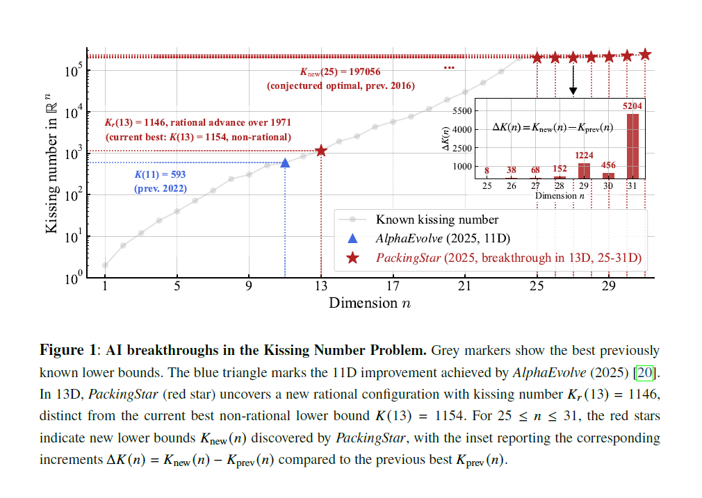

# Official repository of new kissing configurations discovered by ***[PackingStar](https://arxiv.org/abs/2511.13391v1)***


## Introduction

The **Kissing Number Problem** seeks the maximum number of non-overlapping unit spheres that can simultaneously touch a central unit sphere in $n$-dimensional Euclidean space. 

This problem famously originated from a disagreement between Isaac Newton and David Gregory in 1694 regarding the kissing number in 3 dimensions ($n=3$). Newton correctly conjectured the answer was 12, while Gregory believed 13 might be possible. The problem has remained a fundamental challenge, connecting deeply to sphere packing, error-correcting codes, and information theory.

## Mathematical Statements

*Source: [KissingNumber-Wikipedia](https://en.wikipedia.org/wiki/Kissing_number#Mathematical_statement)*

In the coordinate domain, the problem is to determine the maximal number of $N$ vectors in $D$-dimensional space that satisfy specific distance constraints.

Let $x_1, x_2, \dots, x_N \in \mathbb{R}^D$ be the position vectors of the centers of the $N$ surrounding spheres. Assuming the central sphere and all surrounding spheres have a radius of $1/2$ (so the centers are at distance 1 from the origin), the conditions are:

1.  **Tangent with Central Sphere:** All centers must lie on the unit sphere.

$$x_i^T x_i = 1 \quad \forall i \in \{1, \dots, N\}$$

2.  **Non-overlapping Condition:** The distance between any pair of surrounding spheres must be at least twice the radius (i.e., $\ge 1$).

$$(x_i - x_j)^T (x_i - x_j) \ge 1 \quad \forall i, j : i \neq j$$

These two requirements can be combined into a single existential logical statement:

$$\exists x \ \{ \forall _ n \{ x_n^T x_n = 1 \} \land \forall _ {m, n : m \neq n} \{ (x_n - x_m)^T (x_n - x_m) \ge 1 \} \}$$


## Results
Our results fall into three categories: (i) new lower bounds in dimensions 25–31, (ii) improved rational constructions in 13 dimensions, and (iii) diverse famlies of configurations in different dimensions.



## File Structure
```
.
├── 12D_14D_15D
│   ├── 12D_diverse_configurations.zip
│   ├── 14D_diverse_configurations.zip
│   └── 15D_diverse_configurations.zip
├── 13D_rational_configurations
│   └── 13D_rational_configurations.zip
├── 25D-31D
│   ├── 25D-31D_new_bounds_configurations.zip
│   ├── partitioned_D5.npy
│   ├── partitioned_E7.npy
│   └── Si_configurations.zip
├── README.md
├── results.png
├── verify_coordinates.py
└── verify_cosmatrix.py     
```
- `verify_coordinates.py`: Script to verify configurations represented by coordinates.
- `verify_cosmatrix.py`: Script to verify configurations represented by Gram matrix.
- `12D_14D_15D/`: Contains diverse configurations in 12, 14, and 15 dimensions.
- `13D_rational_configurations/`: Contains improved rational configurations in 13 dimensions.
- `25D-31D/`: Contains new lower bound configurations for dimensions 25 to 31, along with partitioned kissing configurations and $S_i$ configurations.

> In 31 dimensions, PackingStar uncovers a novel assembly pattern by partitioning a 7-dimensional kissing configuration into 42 (optimal) disjoint unit-radius equilateral triangles, resulting in an $84$-fold weighted $S_i$, surpassing the previous $75$-fold weighted $S_i$. Similarly, in 29 dimensions, 
PackingStar embeds 12 (optimal) disjoint unit-radius equilateral triangles into the 5-dimensional kissing configuration to generate a $26$-fold weighted $S_i$, exceeding the prior $24$-fold weighted $S_i$.

## How to verify our results

### Install dependency
```
pip install numpy
```

### Verifying New Lower Bounds in Dimensions 25-31
New lower bound configurations for dimensions 25 to 31 are stored in the `./25D-31D` directory.

First, unzip the configurations using the command:
```
unzip ./25D-31D/25D-31D_new_bounds_configurations.zip -d ./25D-31D/
```

Second, use the `verify_coordinates.py` script to verify the configurations. 
```
python verify_coordinates.py --file-path ./25D-31D/25D-31D_new_bounds_configurations/<filename> --threshold 0.5 
```

For example, to verify the configuration in 25 dimensions:
```
python verify_coordinates.py --file-path ./25D-31D/25D-31D_new_bounds_configurations/25D_197056_coordinates.npy --threshold 0.5
```

### Verifying Rational Configurations in 13 Dimensions
Rational configurations in 13 dimensions are stored in the `./13D_rational_configurations`
directory.

First, unzip the configurations using the command:
```
unzip ./13D_rational_configurations/13D_rational_configurations.zip -d ./13D_rational_configurations/
```

Second, use the `verify_cosmatrix.py` script to verify the configurations. 
```
python verify_cosmatrix.py --file-path ./13D_rational_configurations/13D_rational_configurations/<filename> --threshold 0.5
```

For example:
```
python verify_cosmatrix.py --file-path ./13D_rational_configurations/13D_rational_configurations/13D-1146-cosmatrix.npy --threshold 0.5
```

### Verifying Configurations in 12, 14, and 15 Dimensions
Configurations in 12, 14, and 15 dimensions are stored in the `./12D_14D_15D` directory.

First, unzip the configurations using the command:
```
unzip ./12D_14D_15D/<filename> -d ./12D_14D_15D/
```

Second, use the `verify_cosmatrix.py` script to verify the configurations. 
```
python verify_cosmatrix.py --file-path ./12D_14D_15D/<n>D_diverse_configurations/<filename> --threshold 0.5
```

For example, we verify the 15-dimensional configuration:
```
unzip ./12D_14D_15D/15D_diverse_configurations.zip -d ./12D_14D_15D/
python verify_cosmatrix.py --file-path ./12D_14D_15D/15D_diverse_configurations/15D-2564-cosmatrix_variant_1.npy --threshold 0.5
``` 
